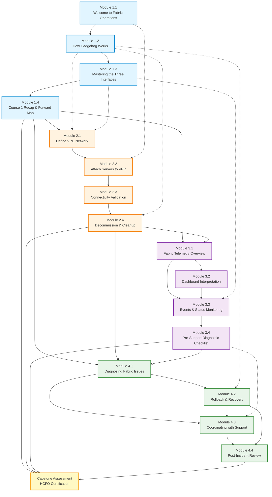

# Module Dependency Graph

**Pathway:** Network Like a Hyperscaler with Hedgehog
**Certification:** Hedgehog Certified Fabric Operator (HCFO)
**Total Modules:** 16 core modules (4 courses × 4 modules)

---

## Visual Dependency Graph



**Legend:**
- **Solid arrows (→)**: Hard prerequisites (must complete before)
- **Dotted arrows (-.->)**: Soft prerequisites (concepts referenced but not blocking)
- **Colors**: Course 1 (blue), Course 2 (orange), Course 3 (purple), Course 4 (green), Capstone (yellow)

---

## Module-by-Module Prerequisites

### Course 1: Foundations & Interfaces

**Module 1.1: Welcome to Fabric Operations**
- Prerequisites: None (entry point)
- Enables: Module 1.2

**Module 1.2: How Hedgehog Works**
- Prerequisites: Module 1.1
- Enables: Module 1.3, Module 2.1 (GitOps workflow), Module 4.2 (rollback)

**Module 1.3: Mastering the Three Interfaces**
- Prerequisites: Module 1.2
- Enables: Module 1.4, Module 2.1 (three interfaces), Module 3.3 (kubectl basics)

**Module 1.4: Course 1 Recap & Forward Map**
- Prerequisites: Modules 1.1, 1.2, 1.3
- Enables: All of Course 2, Course 3, Course 4

---

### Course 2: Provisioning & Connectivity

**Module 2.1: Define VPC Network**
- Prerequisites:
  - **Hard:** Module 1.4 (Course 1 complete)
  - **Soft:** Module 1.2 (GitOps), Module 1.3 (three interfaces)
- Enables: Modules 2.2, 2.3, 2.4

**Module 2.2: Attach Servers to VPC**
- Prerequisites:
  - **Hard:** Module 2.1 (VPC created)
  - **Soft:** Module 1.2 (GitOps), Module 1.1 (topology)
- Enables: Modules 2.3, 2.4

**Module 2.3: Connectivity Validation**
- Prerequisites:
  - **Hard:** Module 2.2 (servers attached), Module 2.1 (VPC with DHCP)
  - **Soft:** Module 1.3 (kubectl, Grafana)
- Enables: Module 2.4

**Module 2.4: Decommission & Cleanup**
- Prerequisites:
  - **Hard:** Module 2.3 (validation workflow), Module 2.2 (attachments), Module 2.1 (VPC lifecycle)
  - **Soft:** Module 1.2 (GitOps)
- Enables: Course 2 completion, Course 3

---

### Course 3: Observability & Fabric Health

**Module 3.1: Fabric Telemetry Overview**
- Prerequisites:
  - **Hard:** Course 1 complete (1.4), Course 2 complete (2.4)
- Enables: Modules 3.2, 3.3, 3.4

**Module 3.2: Dashboard Interpretation**
- Prerequisites:
  - **Hard:** Module 3.1 (Prometheus/PromQL basics)
- Enables: Module 3.3

**Module 3.3: Events & Status Monitoring**
- Prerequisites:
  - **Hard:** Module 3.1 (telemetry), Module 3.2 (dashboards)
  - **Soft:** Module 1.3 (kubectl basics)
- Enables: Module 3.4

**Module 3.4: Pre-Support Diagnostic Checklist**
- Prerequisites:
  - **Hard:** Module 3.1, 3.2, 3.3
- Enables: Course 3 completion, Module 4.3 (support escalation)

---

### Course 4: Troubleshooting, Recovery & Escalation

**Module 4.1: Diagnosing Fabric Issues**
- Prerequisites:
  - **Hard:** Course 1 complete, Course 2 complete, Course 3 complete
- Enables: Modules 4.2, 4.3

**Module 4.2: Rollback & Recovery**
- Prerequisites:
  - **Hard:** Module 4.1 (diagnosis)
  - **Soft:** Module 1.2 (GitOps workflow), Course 2 (VPC lifecycle)
- Enables: Modules 4.3, 4.4

**Module 4.3: Coordinating with Support**
- Prerequisites:
  - **Hard:** Module 4.1 (diagnosis), Module 4.2 (recovery)
  - **Soft:** Module 3.4 (diagnostic checklist)
- Enables: Module 4.4

**Module 4.4: Post-Incident Review**
- Prerequisites:
  - **Hard:** Modules 4.1, 4.2, 4.3, All previous courses
- Enables: Capstone Assessment, HCFO Certification

---

## Critical Path Analysis

**Critical Path** (longest prerequisite chain from start to finish):

```
Module 1.1 → 1.2 → 1.3 → 1.4 → 2.1 → 2.2 → 2.3 → 2.4 → 3.1 → 3.2 → 3.3 → 3.4 → 4.1 → 4.2 → 4.3 → 4.4 → Capstone
```

**Total modules on critical path:** 16 modules + capstone
**Estimated duration:** ~4 hours core content + 1-1.5 hours capstone = **5-5.5 hours total**

**Key Observations:**
- All modules are on the critical path (linear progression through courses)
- No parallel learning paths (each module builds on previous)
- Course boundaries are natural checkpoints

---

## Prerequisite Categories

### 1. Entry Point
- **Module 1.1** - No prerequisites, accessible to all learners

### 2. Course Gatekeepers (require previous course completion)
- **Module 2.1** - Requires Course 1 complete
- **Module 3.1** - Requires Courses 1 & 2 complete
- **Module 4.1** - Requires Courses 1, 2, & 3 complete

### 3. Course Capstones (end-of-course modules)
- **Module 1.4** - Recap Course 1
- **Module 2.4** - Recap Course 2 (also teaches cleanup)
- **Module 3.4** - Recap Course 3 (also teaches diagnostics)
- **Module 4.4** - Recap Course 4 (also teaches PIR)

### 4. Cross-Course Dependencies (referenced by multiple courses)
- **Module 1.2 (GitOps)** - Used in Courses 2, 4
- **Module 1.3 (Three Interfaces)** - Used in Courses 2, 3
- **Module 3.4 (Diagnostic Checklist)** - Used in Course 4

---

## Dependency Validation

### Circular Dependency Check: ✅ PASS
- No circular dependencies detected
- All prerequisite chains are acyclic
- Clear directed flow from 1.1 → 4.4 → Capstone

### Completeness Check: ✅ PASS
- All 16 modules represented
- All stated prerequisites captured
- All enables relationships validated

### Course Boundary Check: ✅ PASS
- Course 1: Self-contained (1.1 → 1.2 → 1.3 → 1.4)
- Course 2: Requires Course 1 complete
- Course 3: Requires Courses 1 & 2 complete
- Course 4: Requires Courses 1, 2, & 3 complete

---

## Learning Path Implications

### For Students:
- **Linear progression required** - Cannot skip modules
- **Course-based checkpoints** - Natural stopping points between courses
- **Clear prerequisites** - Always know what to complete next
- **4-5 hour commitment** - Complete pathway in one intensive session or spread over days

### For Instructors:
- **Sequential delivery** - Modules must be taught in order
- **Course boundaries** - Natural break points for multi-session training
- **Prerequisite enforcement** - Platform can block access until prerequisites met
- **Progress tracking** - Linear path simplifies completion tracking

### For Content Developers:
- **Development order** - Follow critical path (1.1 → 1.2 → ... → 4.4)
- **Testing dependencies** - Must complete previous modules to test current
- **Cross-references** - Modules 1.2, 1.3, 3.4 referenced by later courses (ensure stability)

---

## Optional Modules

**Background modules** (not on critical path, can be taken anytime):
- Kubernetes CRD Fundamentals
- Network Primitives (routing, forwarding, segmentation)
- IP Addressing & Subnetting Primer
- YAML Best Practices
- GitOps Workflow Basics
- Observability 101 (Logs, Metrics, Traces)
- Network Troubleshooting Methodology

**Recommendation:** Take optional modules **before Module 2.1** if learner needs background knowledge.

---

## Capstone Assessment

**Prerequisites:** All 16 core modules (Courses 1-4) complete
**Format:** Integrated hands-on assessment
**Duration:** 60-90 minutes
**Certification:** Hedgehog Certified Fabric Operator (HCFO)

---

## Dependency Graph Metadata

**Created:** 2025-10-16
**Author:** Course Lead (Claude Code)
**Version:** 1.0
**Status:** ✅ COMPLETE
**Total Modules:** 16 core + capstone
**Prerequisite Links:** 21 hard dependencies, 7 soft dependencies
**Critical Path Length:** 16 modules
**Circular Dependencies:** None detected

---

**Next Steps:**
1. Design Capstone Assessment (maps to all 16 modules)
2. Validate dependency graph with sample student walkthrough
3. Use graph to inform Phase 3 content development priorities
